<div align="center">

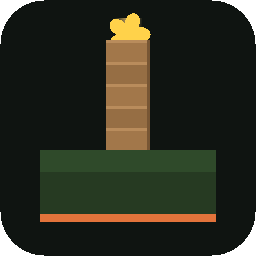

# Feastfall

**A first-person, low-poly battle royale about towers, traps, feasts and long falls.**

Runs in the browser or as a Windows app. Up to 99 other fighters. One survivor.

[](https://github.com/jonahsaunders/feastfall/releases/latest)


[**Download**](https://github.com/jonahsaunders/feastfall/releases/latest) · [Play in the browser](#in-the-browser-solo-no-install) · [Play online](#in-the-browser-online-with-friends) · [Controls](#controls) · [How it's built](#how-its-built)

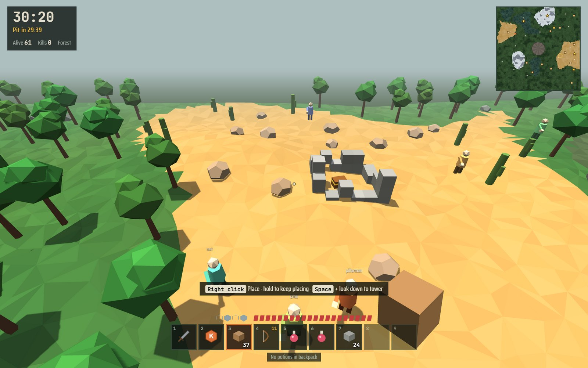

</div>

Drop into a freshly generated forest, desert, mountain and swamp map, gather and craft, build towers and traps, and be the last one standing. There's no mindless pointing: you win by reading the map, managing potions and using height.

## Features

<table>
<tr>
<td width="50%" valign="top">
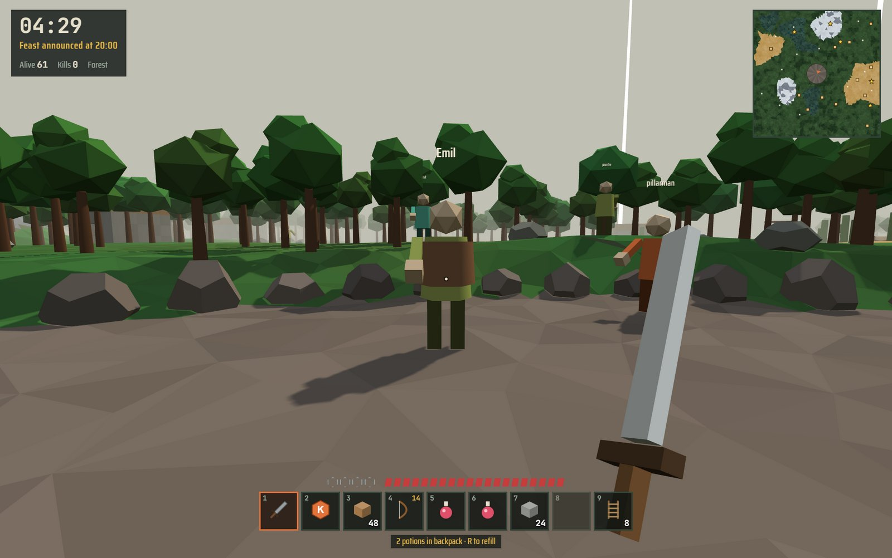
<p><b>Four ways to play.</b> Hunt people, mine rats in the tunnels for armour, set spike traps near the swamp, or tower up.</p>
</td>
<td width="50%" valign="top">
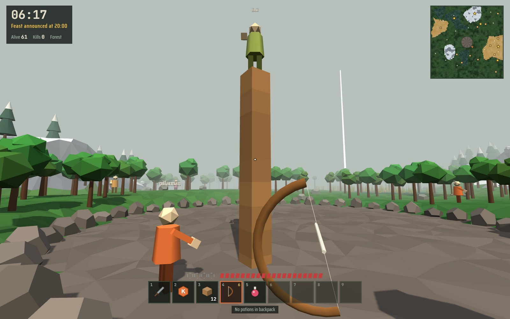
<p><b>Towers and falls.</b> Craft planks and cobblestone, place blocks, pillar-jump up and shoot from above. Fall damage is real, so knockback, grappling hooks and lightning all bring towers down.</p>
</td>
</tr>
<tr>
<td width="50%" valign="top">
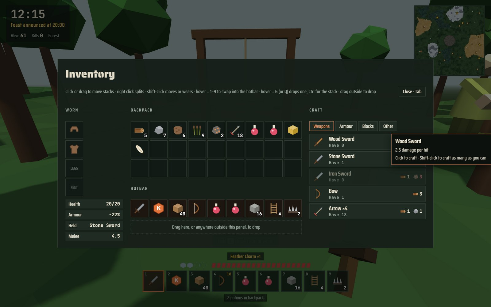
<p><b>Gather and craft.</b> Chop trees, break rocks, cut reeds and mine iron, then turn them into swords, bows, armour, blocks, ladders and traps.</p>
</td>
<td width="50%" valign="top">
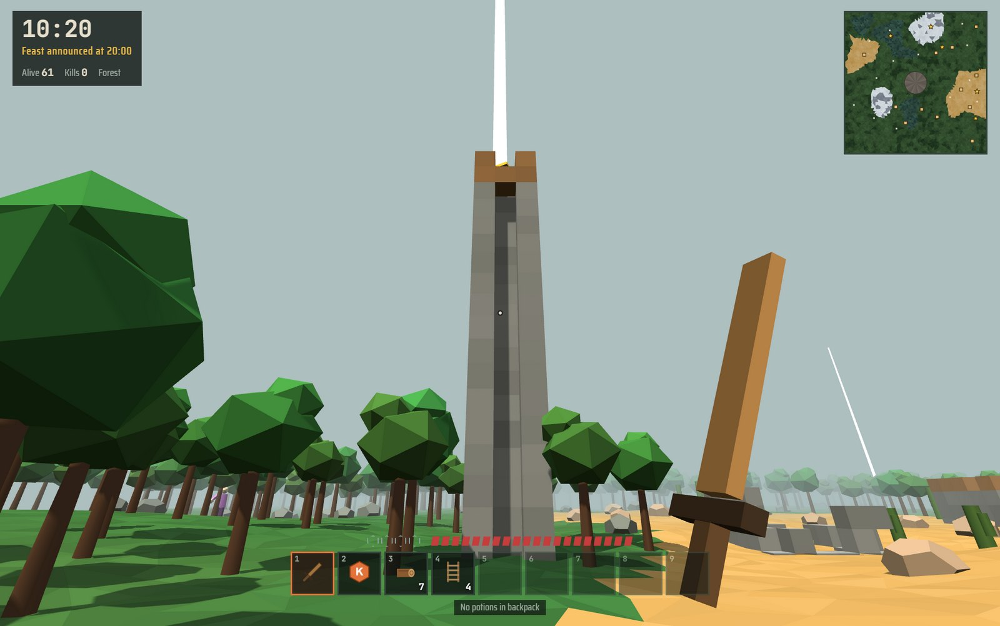
<p><b>Five legendary items</b>, one of each per match, each waiting at its own landmark under a beam of light. See <a href="#legendaries">Legendaries</a>.</p>
</td>
</tr>
<tr>
<td width="50%" valign="top">
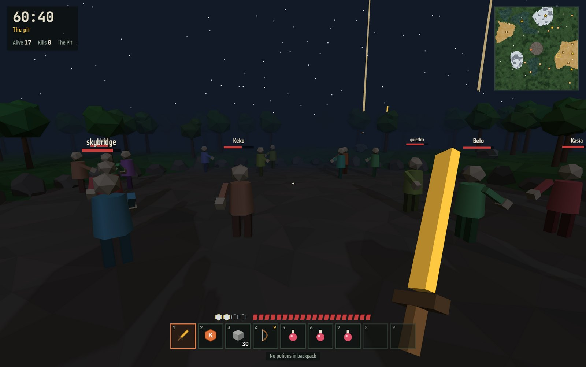
<p><b>A 60-minute match from dawn to night.</b> Grace period, a feast at 25:00 with the best gear, dusk around 45:00, and at 60:00 everyone left is dropped into the pit under the stars.</p>
</td>
<td width="50%" valign="top">
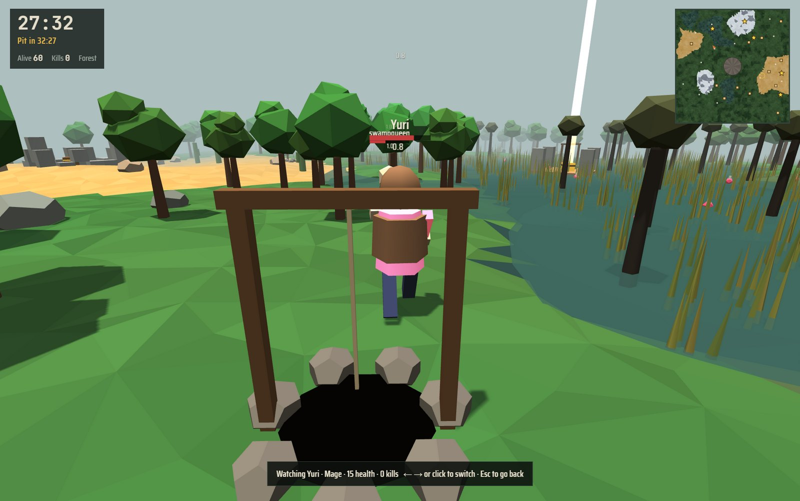
<p><b>After you die:</b> spectate whoever's left, and see your damage dealt, blocks placed, longest fall and potions drunk. The menu keeps your lifetime record.</p>
</td>
</tr>
</table>

- **28 kits** with 8 free each week (see [Kits](#kits)).
- **Ruins to loot.** Cabins, broken walls and watchtowers built from real blocks, each with a chest. Watchtower chests hold the best loot, and you climb a ladder to reach them.
- **Ladders.** Craft them, lean them against a wall and climb. No fall damage while you're on one.
- **A new map every match.** Mountain ranges, deserts, swamps, ruins, landmarks and feast sites are placed at random from the match seed, in three sizes: Standard, Large (default) and Huge.
- **Online multiplayer** for up to 16 players plus bots, through a small relay server included here. The desktop app runs that server for you.
- **Everything is generated in code:** the low-poly world, the item icons and the ambient music and sound effects. There are no asset files.

### A match, minute by minute

| Clock | What happens |
| --- | --- |
| 00:00 | Dawn. Everyone spawns away from landmarks and ruins. Chop wood, craft planks, find potions |
| 02:00 | The grace period ends and PvP turns on |
| 20:00 | The feast is announced and marked on your map |
| 25:00 | The feast opens: Feast Blades, feast armour and potions |
| ~45:00 | Dusk. Names get harder to read from a distance |
| 60:00 | Night. Everyone left is dropped into the pit. Last one standing wins |

### Kits

28 kits, 8 of them free each week. The rest unlock with coins earned in matches (50 per kill, 200 for a win).

| Style | Kits |
| --- | --- |
| Fighters | Killer, Puncher, Leech, Blight, Shade, Duelist, Heavy, Bulwark |
| Movement | Jumper, Runner, Faller, Mage, Fisherman, Trickster |
| Builders and trappers | Tripwire, Snare, Updraft, Sapper, Cutter, Lightning |
| Stealth and survival | Hidden, Faker, Jinx, Finder, Recluse, Yeti, Bogwalker, Thrower |

<p align="center">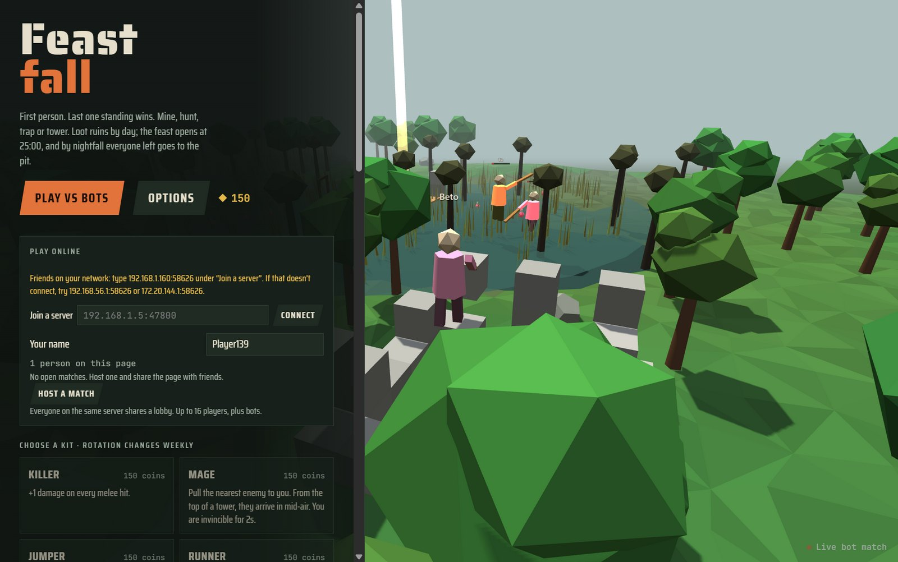</p>

## Legendaries

Each match has exactly one of each legendary, sitting in a gold chest at a landmark. Landmarks are gold stars on the map, and a beam of light marks each one until its item is taken. When someone takes one, everyone is told who has it. Legendaries drop in the owner's death bag like anything else, so they change hands.

<table>
<tr>
<td width="33%">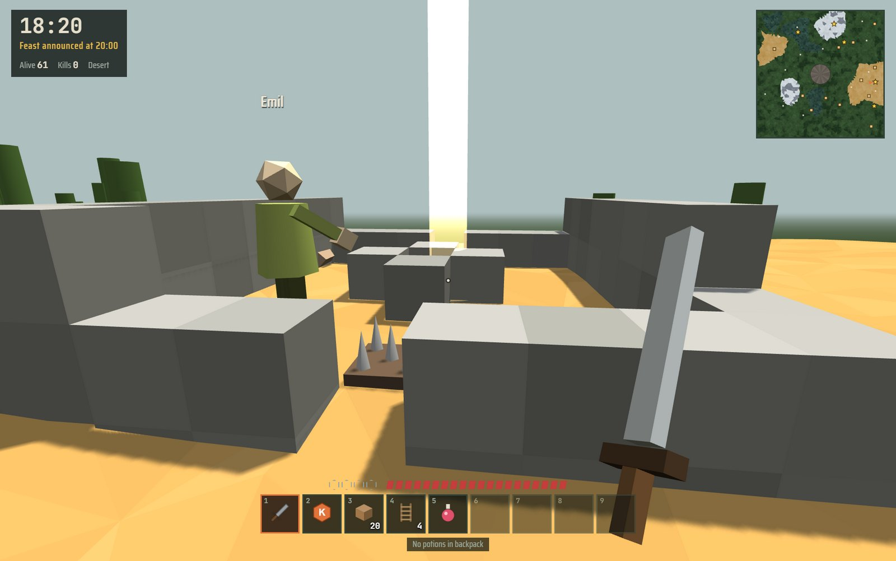<br><sub>The Sunken Forge</sub></td>
<td width="33%">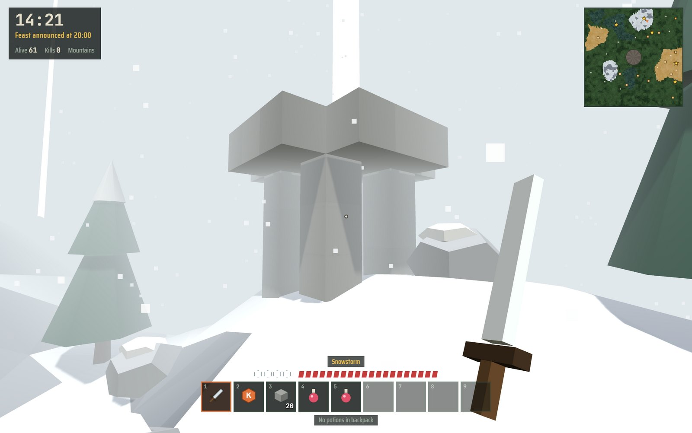<br><sub>Frostpeak Shrine</sub></td>
<td width="33%">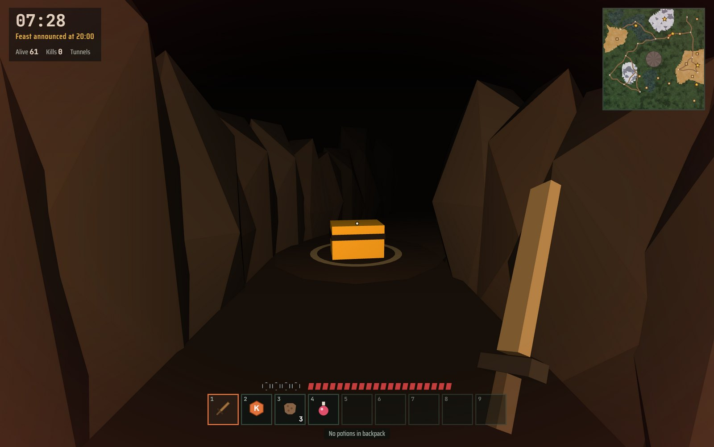<br><sub>The Rat King's Nest</sub></td>
</tr>
</table>

| Item | Landmark | Effect |
| --- | --- | --- |
| Skyhook | The Crow's Nest: a 16-block cobblestone spire in the forest, climbed by ladder | Click to grapple to any block or the ground up to 22 blocks away. Recharges in 6 s |
| Quake Maul | The Sunken Forge: a walled ring in the desert with spike traps in both gateways | Slow swings that launch people upward and knock them far. Breaks any block in one hit |
| Everflask | The Drowned Altar: a platform in the middle of the swamp | Heals like a potion, then refills itself after 25 s instead of being used up |
| Windwalker Boots | Frostpeak Shrine: the highest open ground in the mountains | No fall damage, ever. Hold Space while falling to glide |
| Rat King's Crown | The Rat King's Nest: the biggest tunnel junction, guarded by rats that bite | Rats ignore you, your rat kills no longer ping your position, and underground your map shows everyone in the tunnels |

## Play

### Desktop app (Windows)

Download `Feastfall-Setup-<version>.exe` (installer) or `Feastfall-<version>-portable.exe` (runs without installing) from the [latest release](https://github.com/jonahsaunders/feastfall/releases/latest), or build them yourself:

```bash
npm install
npm run dist
```

The files land in `dist/`. To run from source without building, use `npm run desktop`.

The app runs its own game server. Your online panel shows your address on the local network (for example `192.168.1.160:47800`): friends on the same network type it under **Join a server**. The first time you open the app, Windows asks whether to let it through the firewall. Allow it on private networks if you want friends to join. F11 toggles fullscreen.

> [!NOTE]
> The builds aren't code-signed, so Windows SmartScreen says "Windows protected your PC" the first time. Choose **More info → Run anyway**.

### In the browser, solo (no install)

Serve the folder with any static file server and open it in a desktop browser (you need a keyboard and mouse):

```bash
npx serve .
```

or `python -m http.server 8000`. Opening `index.html` straight from disk won't work, because browsers block scripts on `file://` pages.

Solo play also works on **GitHub Pages**: push the repository and turn on Pages for the main branch.

### In the browser, online with friends

```bash
npm install
npm start
```

Open `http://localhost:8080`. The page connects back to the same server, so everyone who opens that address shares a lobby. The online panel shows the address friends on your network can open. Browser players and desktop players can play together: either one can type the other's address under **Join a server**. One player clicks **Host a match**, everyone else clicks **Join**, and the host starts it. To play over the internet, run the server on any Node host (Render, Fly.io, Railway, a VPS) and share its address. Set `PORT` to change the port.

To keep the page on GitHub Pages and run only the server elsewhere, set the server address in `config.js`:

```js
window.FEASTFALL_SERVER = 'wss://your-server.example.com/ws';
```

or add it to the link for one visit: `https://you.github.io/feastfall/?server=wss://your-server.example.com/ws`.

For a quick test without a server, open the page on `localhost` in two tabs of the same browser: they find each other through a local channel.

## Controls

| Key | Action |
| --- | --- |
| WASD · mouse | Move · look (click the game to capture the mouse) |
| Space · Shift | Jump · sneak (you won't walk off edges, and it blocks Faller damage). Walk into a ladder, or hold Space, to climb |
| Left click | Swing (hold to keep swinging), hold on a block to break it, draw the bow, use the held item |
| Right click | Place the held block (hold, jump and look down to tower up), otherwise drink |
| 1–9 · wheel | Select a hotbar slot |
| Tab | Inventory and crafting |
| Q · F · R | Kit ability · drink · refill the hotbar with potions from your backpack |
| E | Enter or leave a tunnel; hold to chop, mine or cut reeds |
| G · Ctrl+G | Drop one of the held item · drop the whole stack |
| P (hold) | Scoreboard |
| T | Chat (online) |
| Esc | Release the mouse and pause |

<details>
<summary><b>Mouse capture, spectating, tips and the inventory</b></summary>

<br>

Mouse look works by capturing the mouse, like any first-person game. Some windows can't do that (embedded browsers inside other apps, for example). There the game switches to free-look: the cursor is hidden, moving the mouse turns the view, and resting it against the window edge keeps turning. Chrome, Edge, Firefox and the desktop app capture the mouse normally.

After you die, the end screen offers **Spectate**: ← → or clicking switches between players, and Esc goes back.

New players get short tips during their first match. Turn them off, or show them again, in Options.

In the inventory: click or drag to move stacks, right-click to split a stack, shift-click to move items or put on armour, and hover over a slot and press 1–9 to swap it into the hotbar. To drop things, drag a stack outside the panel, click outside it while holding one, or hover over a slot and press G or Q (Ctrl drops the whole stack).

</details>

## How it's built

Plain JavaScript, no build step for the browser version. [three.js](https://threejs.org/) r128 and the Saira and JetBrains Mono fonts are bundled in `vendor/`. The desktop app is built with [Electron](https://www.electronjs.org/) and electron-builder.

| File | What it does |
| --- | --- |
| `index.html` | Page, HUD, menus and styles |
| `config.js` | Where online play connects |
| `js/world.js` | Seeded map: biomes, trees, rocks, reeds, tunnels |
| `js/blocks.js` | Placeable blocks, collision, fall support, raycasting |
| `js/items.js` | Item registry, drawn icons, inventory, armour, recipes |
| `js/entities.js` | Fighters, combat, kits, falling, traps, rats, projectiles, ground items |
| `js/bots.js` | Bot playstyles: hunter, miner, trapper, tower, balanced |
| `js/net.js` | Online play: lobby, matches, state sync, host migration |
| `js/scene3d.js` | Renderer, lights, terrain mesh, instanced scenery, tunnels |
| `js/view3d.js` | Per-frame 3D: players, items, effects, first-person held item, minimap |
| `js/audio.js` | Generated ambient music and positional sound effects |
| `js/main.js` | Game loop, input, HUD, inventory screen, menus, kit store |
| `server.js` | Static file server plus a WebSocket relay for multiplayer |
| `desktop/main.js` | The Windows app: starts `server.js` inside the app and opens the game window |
| `vendor/` | three.js r128 (MIT) and the fonts (SIL Open Font License), bundled so the game works offline |

### Multiplayer model

Each player's browser runs their own character and shares its state about 10 times a second. The player who hosts a match also runs the bots, the clock, potions, feast chests and item pickups. Hits, block edits, deaths and item changes are sent as messages, and the browser that runs a fighter applies damage to it. If the host leaves, the next player takes over the bots and the match continues. The server only relays messages between players in the same room; it knows nothing about the game.

Because the clients are trusted, a modified client could cheat. That's fine for playing with friends. A public server would need the game rules to move onto the server.

## Known limits

- You can't join a match that's already running.
- Rats in the tunnels are separate for each player (their hide drops are real).
- On a bad connection a block edit or hit can occasionally be lost.
- 99 bots needs a fast computer. Turn shadows off in Options if it runs slowly.
- Money purchases in the kit store aren't implemented. Kits unlock with coins earned in matches.

## License

No license has been chosen yet. Until one is added, all rights are reserved by the author.
