<div align="center">


# Feastfall

**A first-person, low-poly battle royale about towers, traps, feasts and long falls.**

Runs in the browser or as a Windows app. Up to 99 other fighters. One survivor, or one squad.

[](https://github.com/jonahsaunders/feastfall/releases/latest)


[**Download**](https://github.com/jonahsaunders/feastfall/releases/latest) · [Features](#features) · [Play online](#in-the-browser-online-with-friends) · [Controls](#controls) · [How it's built](#how-its-built)


</div>

Drop into a freshly generated map of forest, desert, mountains and swamp. Gather and craft, build towers, forts and traps, and be the last one standing. You win by reading the map, managing potions and using height, not just by clicking first.

> [!TIP]
> **New in 0.10:** [duos](#play-together) with revives, the [play of the match](#replays-and-the-end-screen), doors, trapdoors, stairs and slabs, kill feed icons and gravestones, a full-screen map, combat music and an announcer. See the [release notes](https://github.com/jonahsaunders/feastfall/releases/latest).

## Quick start

- **Windows:** download the installer or the portable `.exe` from the [latest release](https://github.com/jonahsaunders/feastfall/releases/latest) and run it.
- **Browser:** serve this folder (`npx serve .`) and open it in a desktop browser. [More](#in-the-browser-solo-no-install)
- **With friends:** `npm install` then `npm start`, and everyone opens the address it prints. [More](#in-the-browser-online-with-friends)

Chop a tree (hold **E**), open the inventory (**Tab**), craft a Wood Sword, and find potions in the swamp before PvP turns on at 02:00. Press **M** for the map.

## Features

### The match

A 60-minute match runs from dawn to night. How long that takes in real time is up to you (5 to 60 minutes, in Options).

<table>
<tr>
<td width="33%" valign="top">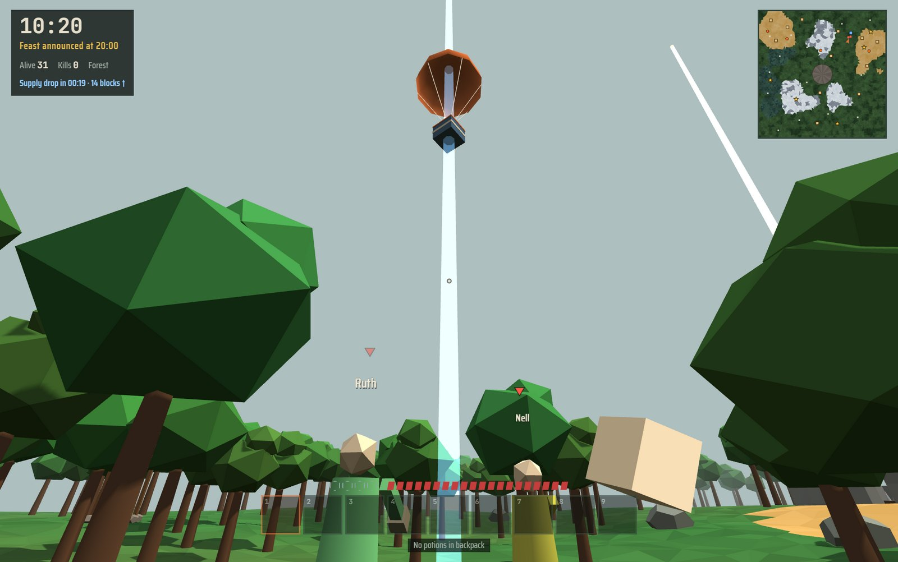<br><sub><b>Supply drops.</b> Three a match, announced three minutes ahead and marked in blue on the map.</sub></td>
<td width="33%" valign="top"><br><sub><b>Five legendaries,</b> one of each per match, each at its own landmark under a beam of light. See <a href="#legendaries">Legendaries</a>.</sub></td>
<td width="33%" valign="top"><br><sub><b>The pit.</b> At 60:00, everyone left is dropped into an arena under the stars.</sub></td>
</tr>
</table>

| Clock | What happens |
| --- | --- |
| 00:00 | Dawn. Everyone spawns away from landmarks and ruins. Chop wood, craft planks, find potions |
| 02:00 | The grace period ends and PvP turns on |
| ~11:00 | The first supply drop lands (announced at ~08:00) |
| 20:00 | The feast is announced and marked on your map |
| 25:00 | The feast opens: Feast Blades, feast armour and potions |
| ~31:00 | The second supply drop |
| ~45:00 | Dusk. Names get harder to read from a distance |
| ~47:00 | The last supply drop |
| 60:00 | Night. Everyone left is dropped into the pit. Last one (or last squad) standing wins |

- **A new map every match.** Mountain ranges, deserts, swamps, ruins, landmarks and feast sites are placed from the match seed, in four sizes: Standard, Large (default), Huge and Colossal (three times as wide as Standard, with more helicopters, motorcycles, ruins and tunnels to match). There are also four [map types](#map-types).
- **Ruins to loot.** Cabins, broken walls and watchtowers built from real blocks, each with a chest. Watchtower chests hold the best loot, up a ladder.
- **Caves** cut into every mountain range: a stone arch on the surface (a grey peak on the map) leads to a dead-end cave with extra iron and a chest.
- **Lava pools** glow in the mountains and deserts (orange on the map). They burn anyone who walks in, and they fill buckets forever.

### Fight

<table>
<tr>
<td width="50%" valign="top">

<p><b>Four ways to play.</b> Hunt people, mine rats in the tunnels for armour, set spike traps near the swamp, or tower up. Pick from 29 <a href="#kits">kits</a>, 8 of them free each week.</p>
</td>
<td width="50%" valign="top">
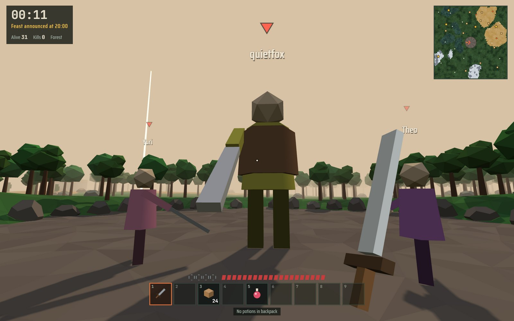
<p><b>Titan kit.</b> Grow to more than twice your size for 8 seconds: longer reach, heavier hits, no knockback or fall damage, and landing from a jump throws everyone near you. You're also much easier to hit.</p>
</td>
</tr>
<tr>
<td width="50%" valign="top">
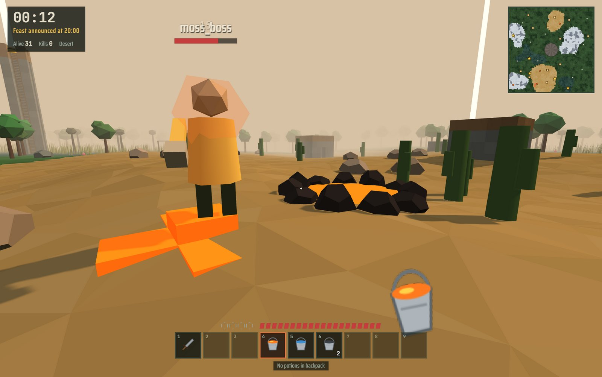
<p><b>Water and lava buckets.</b> Pour lava on people to set them on fire. Pour water under you just before you land and you take no fall damage. Where water meets lava, it hardens into stone.</p>
</td>
<td width="50%" valign="top">
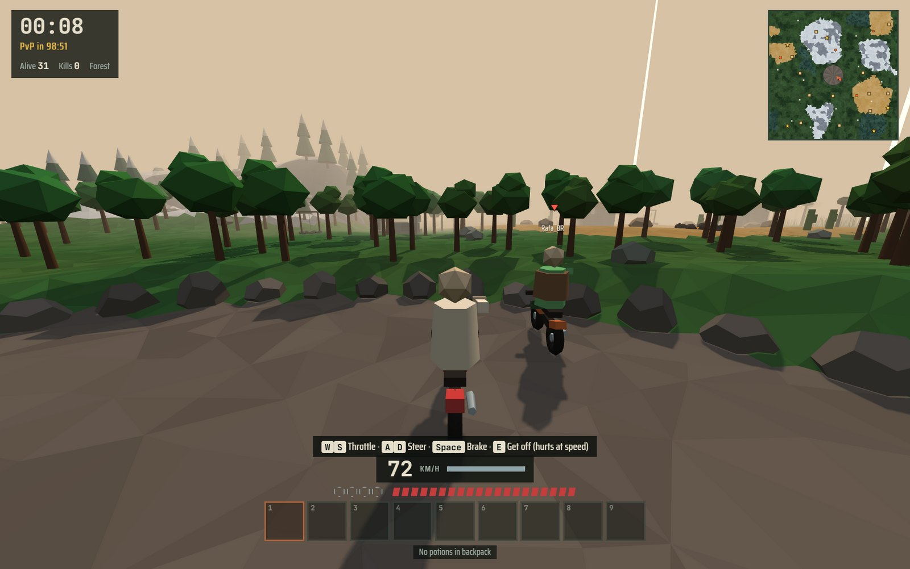
<p><b>Motorcycles.</b> Nearly three times as fast as running, and just as easy to wreck. Hit a tree at full speed and it can kill you, getting off at speed hurts, and a smoking bike is about to explode. Run people over, or crest a dune and fly.</p>
</td>
</tr>
</table>

- **Bounties.** Once someone has 3 or more kills and leads the match, everyone's map shows where they are every 30 seconds, and killing them pays 50 coins plus 25 per kill they had.
- **Kill streaks.** Double and triple kills, killing sprees and special kills (Knocked off, Burned, Long shot, Pitfall, Road kill, Shot down, Rocket, Buried) are called out. Your own earn bonus coins.
- **Clear feedback.** Hit markers tick round your crosshair on every hit (red on a kill, with a click), red wedges point at whoever just hurt you, and the screen edge flashes. Vehicle gauges (fuel or speed, hull, height, ammo) sit right around the crosshair. The end screen breaks down your match: damage dealt and taken, accuracy, longest kill, distance, blocks, potions, and who you eliminated and how.
- **Assists.** Anyone who did 2 or more damage in the last 15 seconds gets an assist in the kill feed, and 20 coins if it's you.
- **See who's around.** Red markers float over anyone within about 50 blocks. Arrows around your crosshair point at people close by but out of view, and anyone you've spotted stays on your minimap for a few seconds. Snowstorms, night and disguises still hide you.
- **Motorcycles** are parked around the map (orange on the minimap when you're close). Swamp, sand and snow slow them down, spike traps shred the tyres, launch pads send them flying and pitfalls wreck them. Bots ride them too.
- **Attack helicopters** wait on helipads (the H on your map: one on Standard maps, two on Large, three on Huge). Each seats two: the **pilot** flies it and the **gunner** sits in the nose with a chain gun (150 rounds) and 6 rockets that blow holes in towers. Fuel only burns in the air, and it lasts about a minute and a half. If the tank runs dry up there the engine quits and the helicopter drops out of the sky and explodes, killing anyone still aboard, so land before it hits zero. A helipad refuels it, and rearms it while the gunner seat is empty. Shots at the crew hit the armoured hull instead: arrows, swords, bullets and rockets can bring it down, and hard landings, crashes, and flying into trees or walls damage it too. Flying solo, press X to jump into the gunner seat: with nobody at the controls it hovers and slowly sinks. In duos a bot partner hops in as your gunner.

### Build and trap

<table>
<tr>
<td width="50%" valign="top">

<p><b>Towers and falls.</b> Place blocks, pillar-jump up and shoot from above. Fall damage is real, so knockback, grappling hooks and lightning all bring towers down.</p>
</td>
<td width="50%" valign="top">
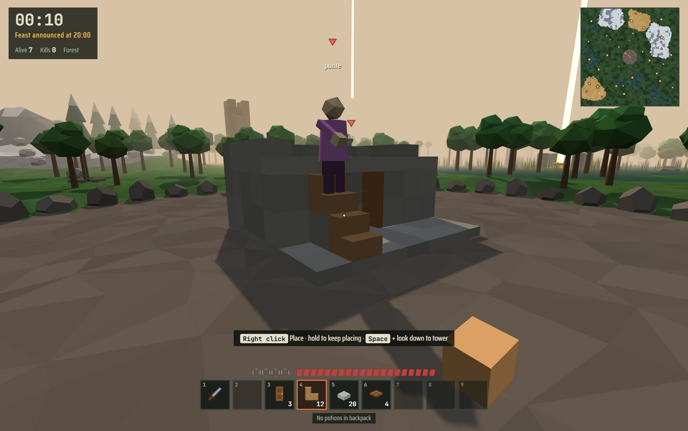
<p><b>Doors, trapdoors, stairs and slabs.</b> Doors and trapdoors open and shut with E or right-click, and bots open them too. Put a trapdoor over a hole or a ladder shaft. Walk straight up stairs and slabs to build ramps and forts.</p>
</td>
</tr>
<tr>
<td width="50%" valign="top">

<p><b>Gather and craft.</b> Chop trees, break rocks, cut reeds and mine iron, then make swords, bows, armour, blocks, ladders, buckets and traps.</p>
</td>
<td width="50%" valign="top">
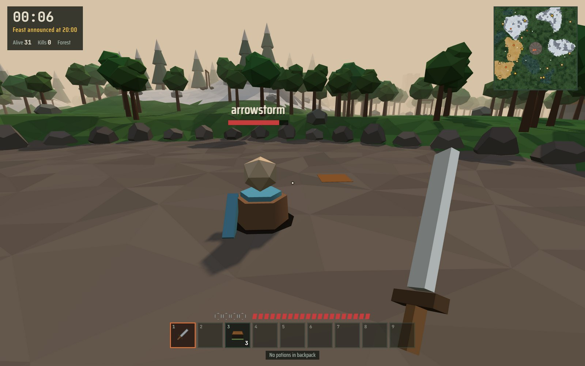
<p><b>Pitfalls.</b> A trapdoor that passes for the ground. Whoever steps on it drops chest-deep into a hole, takes 3 damage and is stuck for 2.5 seconds. Yours show up in brown; other people's you have to spot.</p>
</td>
</tr>
</table>

- **Ladders.** Lean them against a wall and climb. No fall damage while you're on one.
- **Spike traps** anyone can make; Tripwire, Snare and Updraft get blast traps, fake ground and launch pads.
- **The tunnels are yours to change.** Build, put up doors and set traps underground just like on the surface: wall off a passage, hide a pitfall in a dark corner, or fort up in a dead end. Hold left click against the rock to dig a new passage a stride at a time (you get stone as you go), to cut a shortcut, flank someone or tunnel into a cave. A blast trap going off underground, or the Sapper's charge, brings the roof down in a **cave-in**: rubble seals the tunnel and hurts anyone under it. Dig or break your way back through. Dug passages show on your map.

### Play together

<table>
<tr>
<td width="50%" valign="top">
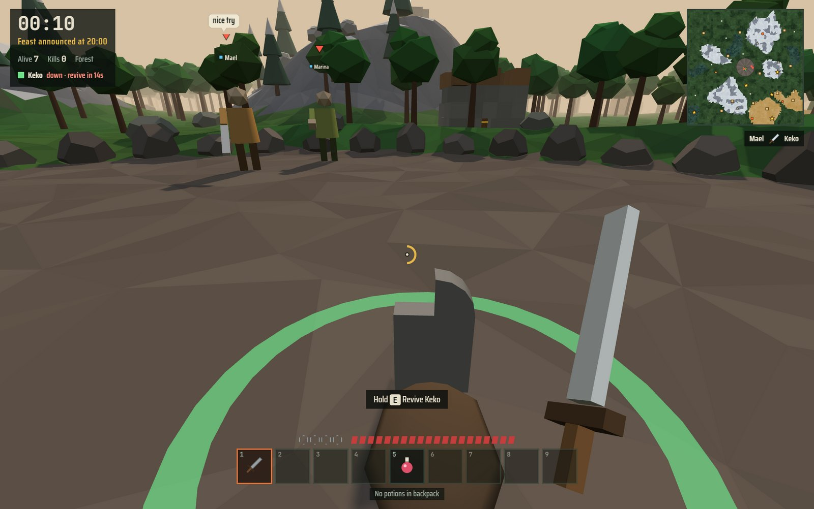
<p><b>Duos.</b> Squads of two, with a bot partner solo or a friend online. Partners can't hurt each other and see each other through walls and on the map. When one goes down, the other has 15 seconds to hold E at the gravestone and bring them back.</p>
</td>
<td width="50%" valign="top">
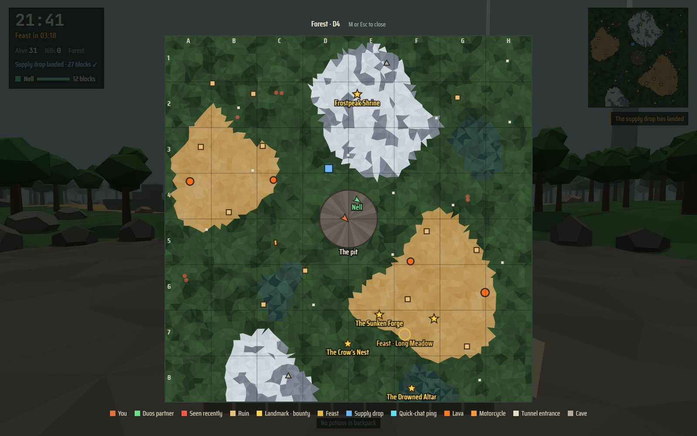
<p><b>Full-screen map.</b> Press M for the whole map with a grid (A–H, 1–8), landmark and feast names, your partner, supply drops, lava, bikes, helipads and helicopters. Handy for calling out where to meet.</p>
</td>
</tr>
</table>

- **Online multiplayer** for up to 16 players plus bots, through a small relay server included here. The desktop app runs that server for you. The host picks Solo or Duos; players are paired with each other first, then with bots.
- **Private matches, spectating and rematches.** Share a five-character code, watch a match that's already running, and start the next one with everyone still in the room.
- **Emotes and quick chat.** Hold **C** for a wheel: wave, taunt, dance or cheer, or call out "Help!", "Enemy here!", "On my way", "Loot here", "Thanks!" or "Good game". Anyone within about 44 blocks hears you (your duos partner always does), and some lines ping a spot on their map.

### Bots

Bots fill out every match and play by the same rules you do. Choose Easy, Normal or Brutal.

- **They play fair.** They only see what's in their line of sight: hills, trees, rocks and walls hide you. They hear swings, fights, arrows, building, chopping, explosions, engines, helicopters and footsteps, but not sneaking. They take a moment to react when they first spot you.
- **They think.** They remember where they last saw you and come to check, find their way around obstacles and through doors, aim ahead of you when you're moving, back off behind cover to drink when they're hurt, and avoid being outnumbered. Camp up a tower and they shoot you down or build their own pillar next to it.
- **They have personalities.** Cowards run, campers dig in near places people visit, rushers chase whoever's closest, looters go for chests and death bags. They talk too, in speech bubbles and the feed.
- **Rivals.** A bot that kills you remembers you. It comes back in your next solo matches with a ☠ by its name and hunts you down. Beat it for 75 bonus coins; beat it twice and it's gone.
- **Alliances.** Outside duos, bots near each other sometimes team up for a while (a matching colour square by their names), and sooner or later one turns on the other.

### Replays and the end screen

<table>
<tr>
<td width="50%" valign="top">
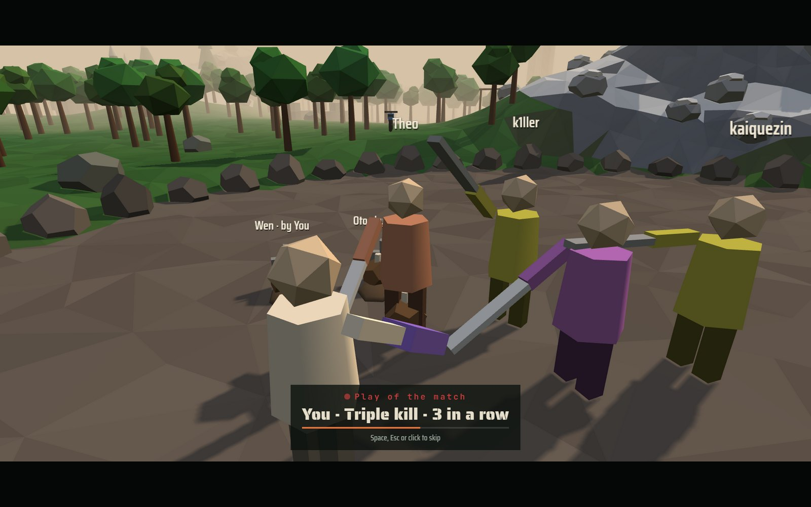
<p><b>Play of the match.</b> The best kill of the match (multi-kills, streaks, long shots, bounties, pitfalls, road kills, low-health clutches, the winning blow) is replayed over the shoulder of whoever made it. It plays after a win, and the end screen always has it.</p>
</td>
<td width="50%" valign="top">
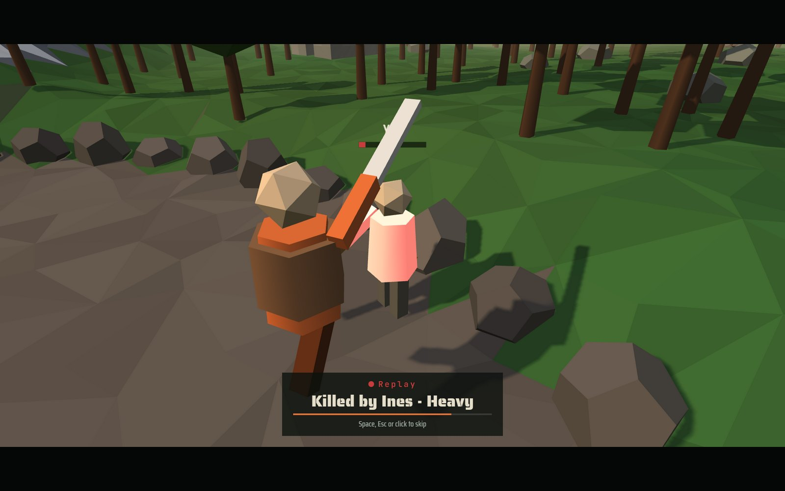
<p><b>Death replay.</b> When you die, the last few seconds play back over your killer's shoulder, slowing down for the final blow. Skip it with Space, or watch it again from the end screen.</p>
</td>
</tr>
<tr>
<td width="50%" valign="top">
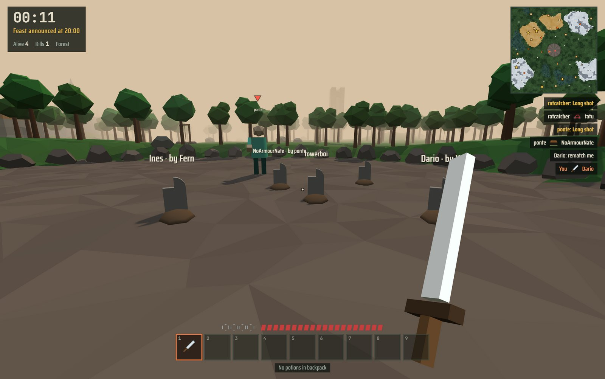
<p><b>Kill feed icons and gravestones.</b> The feed shows how each person died: the weapon, a bow, a fall, fire, a pitfall, a trap, lightning, a motorcycle, a chain gun, a rocket, a helicopter, a cave-in and more. A gravestone marks where they fell, with who got them.</p>
</td>
<td width="50%" valign="top">

<p><b>After you die:</b> spectate whoever's left, and see your place, kills, damage dealt, blocks placed and longest fall. The menu keeps your lifetime record.</p>
</td>
</tr>
</table>

### Sound

- **Music that follows the fight.** A quiet ambient score changes with where you are. Drums and bass build up when enemies are close, when you're in a fight, in the pit and in the final few, and drop back when you hide or sneak.
- **An announcer** calls "Fight!", the feast, supply drops, bounties, how many players are left, the pit, night falling, your streaks, revenge and victory. Turn it off in Options.
- **Footsteps you can place.** Everyone walking makes noise, panned left or right and louder on stone and planks than on grass, sand or snow. You can hear a Titan coming from far off.
- **Everything is generated in code:** the low-poly world, the item icons, the music and the sound effects. There are no asset files.

### Map types

<table>
<tr>
<td width="33%">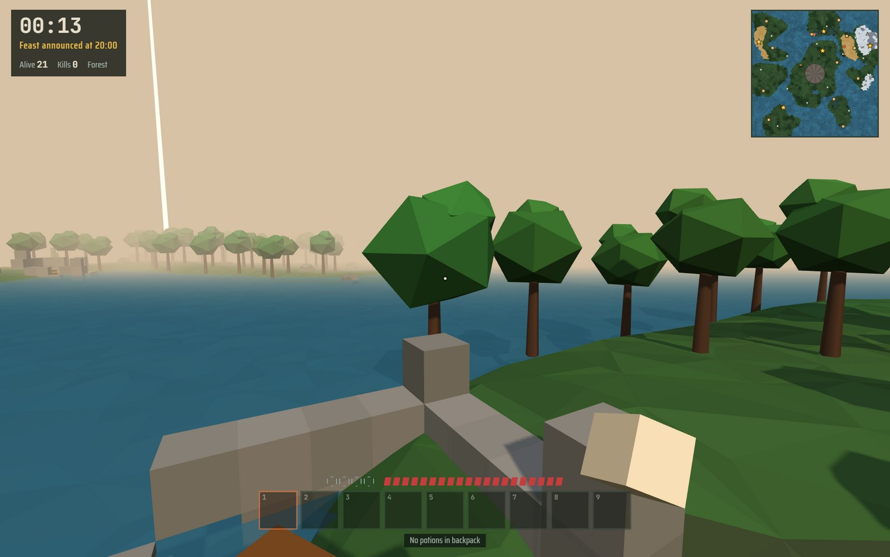<br><sub>Islands</sub></td>
<td width="33%">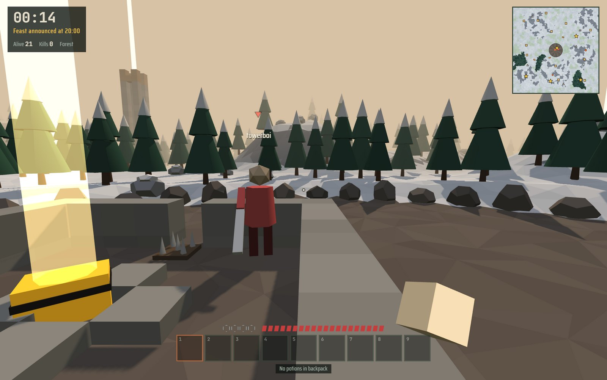<br><sub>Winter</sub></td>
<td width="33%">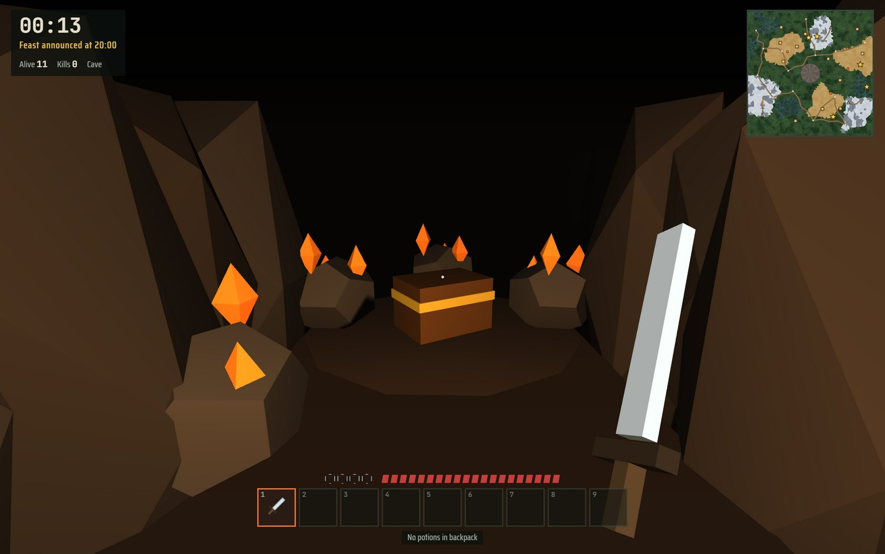<br><sub>A mountain cave</sub></td>
</tr>
</table>

### Kits

29 kits, 8 of them free each week. The rest unlock with coins earned in matches (50 per kill, 200 for a win).

| Style | Kits |
| --- | --- |
| Fighters | Killer, Puncher, Leech, Blight, Shade, Duelist, Heavy, Bulwark, Titan |
| Movement | Jumper, Runner, Faller, Mage, Fisherman, Trickster |
| Builders and trappers | Tripwire, Snare, Updraft, Sapper, Cutter, Lightning |
| Stealth and survival | Hidden, Faker, Jinx, Finder, Recluse, Yeti, Bogwalker, Thrower |

<p align="center"></p>

## Legendaries

Each match has exactly one of each legendary, sitting in a gold chest at a landmark. Landmarks are gold stars on the map, and a beam of light marks each one until its item is taken. When someone takes one, everyone is told who has it. Legendaries drop in the owner's death bag like anything else, so they change hands.

<table>
<tr>
<td width="33%"><br><sub>The Sunken Forge</sub></td>
<td width="33%"><br><sub>Frostpeak Shrine</sub></td>
<td width="33%"><br><sub>The Rat King's Nest</sub></td>
</tr>
</table>

| Item | Landmark | Effect |
| --- | --- | --- |
| Skyhook | The Crow's Nest: a 16-block cobblestone spire in the forest, climbed by ladder | Click to grapple to any block or the ground up to 22 blocks away. Recharges in 6 s |
| Quake Maul | The Sunken Forge: a walled ring in the desert with spike traps in both gateways | Slow swings that launch people upward and knock them far. Breaks any block in one hit |
| Everflask | The Drowned Altar: a platform in the middle of the swamp | Heals like a potion, then refills itself after 25 s instead of being used up |
| Windwalker Boots | Frostpeak Shrine: the highest open ground in the mountains | No fall damage, ever. Hold Space while falling to glide |
| Rat King's Crown | The Rat King's Nest: the biggest tunnel junction, guarded by rats that bite | Rats ignore you, your rat kills no longer ping your position, and underground your map shows everyone in the tunnels |
| Rift Lantern | The Rift Stones: a ring of standing stones on open ground | Left click opens a violet rift where you aim, right click a green one, on the ground, a wall, the tunnel rock or roof. Walk into one and come out of the other at the same speed: drop into a rift in the ground and you're flung out of one on a wall. Anyone can use them, and a pair can link the surface to the tunnels |

## Play

### Desktop app (Windows)

Download `Feastfall-Setup-<version>.exe` (installer) or `Feastfall-<version>-portable.exe` (runs without installing) from the [latest release](https://github.com/jonahsaunders/feastfall/releases/latest), or build them yourself:

```bash
npm install
npm run dist
```

The files land in `dist/`. To run from source without building, use `npm run desktop`.

The app runs its own game server. Your online panel shows your address on the local network (for example `192.168.1.160:47800`): friends on the same network type it under **Join a server**. The first time you open the app, Windows asks whether to let it through the firewall. Allow it on private networks if you want friends to join. F11 toggles fullscreen.

> [!NOTE]
> The builds aren't code-signed, so Windows SmartScreen says "Windows protected your PC" the first time. Choose **More info → Run anyway**.

### In the browser, solo (no install)

Serve the folder with any static file server and open it in a desktop browser (you need a keyboard and mouse):

```bash
npx serve .
```

or `python -m http.server 8000`. Opening `index.html` straight from disk won't work, because browsers block scripts on `file://` pages.

Solo play also works on **GitHub Pages**: push the repository and turn on Pages for the main branch.

### In the browser, online with friends

```bash
npm install
npm start
```

Open `http://localhost:8080`. The page connects back to the same server, so everyone who opens that address shares a lobby. The online panel shows the address friends on your network can open. Browser players and desktop players can play together: either one can type the other's address under **Join a server**. One player clicks **Host a match**, everyone else clicks **Join**, and the host starts it. The host picks the bot count, map size, map type, Solo or Duos, bot difficulty and match length.

- **Private matches:** click **Host private** instead. It isn't listed in the lobby; friends type its five-character code under **Join with a code**.
- **Spectating:** a match that's already running shows **Watch** in the lobby (or join a private one with its code). You get a live copy of the match: follow players with ← →, or press **F** for a free camera (WASD to fly, Space up, Q down).
- **Rematch:** at the end of a match, the host clicks **Rematch** to start a new map with everyone still in the room; everyone else clicks **Ready for a rematch** so the host can see who's in. Spectators who click it join the next match as players.

To play over the internet, run the server on any Node host (Render, Fly.io, Railway, a VPS) and share its address. Set `PORT` to change the port.

To keep the page on GitHub Pages and run only the server elsewhere, set the server address in `config.js`:

```js
window.FEASTFALL_SERVER = 'wss://your-server.example.com/ws';
```

or add it to the link for one visit: `https://you.github.io/feastfall/?server=wss://your-server.example.com/ws`.

For a quick test without a server, open the page on `localhost` in two tabs of the same browser: they find each other through a local channel.

## Controls

Every action key below can be changed in **Options → Controls** (click an action, press the new key; a key that's already taken swaps). Number keys, Esc and the arrow keys are fixed.

| Key | Action |
| --- | --- |
| WASD · mouse | Move · look (click the game to capture the mouse) |
| Space · Shift | Jump · sneak (you won't walk off edges, and it blocks Faller damage). Walk into a ladder, or hold Space, to climb |
| Left click | Swing (hold to keep swinging), hold on a block to break it, draw the bow, use the held item |
| Right click | Place the held block (hold, jump and look down to tower up), open or shut a door (sneak to place against it), fill or pour a bucket, otherwise drink |
| 1–9 · wheel | Select a hotbar slot |
| Tab | Inventory and crafting |
| Q · F · R | Kit ability · drink · refill the hotbar with potions from your backpack |
| E | Open or shut a door or trapdoor, get on or off a motorcycle, get in or out of a helicopter, enter or leave a tunnel; hold to chop, mine or cut reeds, or to revive your partner in duos |
| Left click in the tunnels | Hold against the rock wall to dig forward, or on rubble to clear it |
| M | Full-screen map (M or Esc closes it) |
| On a motorcycle | W · S throttle and brake/reverse, A · D steer, Space hard brake, mouse looks around, E gets off |
| Flying a helicopter | W · S forward and back, A · D strafe, mouse turns, Space up, Shift down, X to the gunner seat (if it's free), E gets out (in the air, you drop) |
| Helicopter gunner | Mouse aims the chin gun, hold left click for the chain gun, right click fires a rocket, X takes the controls (if the pilot seat is free), E gets out |
| G · Ctrl+G | Drop one of the held item · drop the whole stack |
| P (hold) | Scoreboard |
| C (hold) | Emote and quick-chat wheel: move the mouse toward an option and let go |
| T | Chat (online) |
| Esc | Release the mouse and pause |

<details>
<summary><b>Mouse capture, spectating, tips and the inventory</b></summary>

<br>

Mouse look works by capturing the mouse, like any first-person game. Some windows can't do that (embedded browsers inside other apps, for example). There the game switches to free-look: the cursor is hidden, moving the mouse turns the view, and resting it against the window edge keeps turning. Chrome, Edge, Firefox and the desktop app capture the mouse normally.

When you die, a short replay plays first (Space, Esc or a click skips it). The end screen then offers **Rematch**, **Spectate** (← → or clicking switches between players, **F** for a free camera, Esc goes back), **Watch replay** and **Play of the match**. In duos you watch your partner while you're down; Esc gives up.

Trapdoors go in the top half of a block space when you aim at the underside of a block or the upper half of a block's side, so one placed against the edge of a hole sits flush with the floor.

In water, hold Space to swim up. Water puts out fires.

New players get short tips during their first match. Turn them off, or show them again, in Options.

In the inventory: click or drag to move stacks, right-click to split a stack, shift-click to move items or put on armour, and hover over a slot and press 1–9 to swap it into the hotbar. To drop things, drag a stack outside the panel, click outside it while holding one, or hover over a slot and press G or Q (Ctrl drops the whole stack).

</details>

## How it's built

Plain JavaScript, no build step for the browser version. [three.js](https://threejs.org/) r128 and the Saira and JetBrains Mono fonts are bundled in `vendor/`. The desktop app is built with [Electron](https://www.electronjs.org/) and electron-builder.

| File | What it does |
| --- | --- |
| `index.html` | Page, HUD, menus and styles |
| `config.js` | Where online play connects |
| `js/world.js` | Seeded map: map types, biomes, trees, rocks, reeds, tunnels, caves, lava pools, supply drop sites, helipads |
| `js/blocks.js` | Placeable blocks (on the surface and in the tunnels), doors, slabs and stairs, rubble, collision, fall support, raycasting, poured water and lava |
| `js/items.js` | Item registry, drawn icons, inventory, armour, recipes |
| `js/entities.js` | Fighters, combat, kits, falling, traps, rats, projectiles, ground items |
| `js/bikes.js` | Motorcycles: riding, jumps, crashes, running people over, explosions |
| `js/tunnels.js` | Digging new passages and cave-ins |
| `js/rifts.js` | The Rift Lantern: opening, linking and travelling through rifts |
| `js/helis.js` | Attack helicopters: seats, flying, fuel, the chain gun and rockets, damage and explosions, bot gunners |
| `js/bots.js` | Bot playstyles (hunter, miner, trapper, tower, balanced), personalities, difficulty, tactics and alliances |
| `js/botmind.js` | What bots notice (line of sight, noises, memory) and how they get around (pathfinding) |
| `js/social.js` | Bot chat, rivals, emotes, quick chat and map pings |
| `js/squads.js` | Duos: squads, partners, revives |
| `js/net.js` | Online play: lobby, private matches, spectating, rematches, state sync, host migration |
| `js/scene3d.js` | Renderer, lights, terrain mesh, instanced scenery, helipads, tunnels and the rock walls digging reshapes |
| `js/view3d.js` | Per-frame 3D: players, markers, items, gravestones, effects, supply drops, first-person held item, minimap and full-screen map |
| `js/replay.js` | Records the last few seconds, for the death replay and the play of the match |
| `js/audio.js` | Generated ambient and combat music, the announcer, positional stereo sound effects and footsteps |
| `js/main.js` | Game loop, input, HUD, inventory screen, menus, kit store |
| `server.js` | Static file server plus a WebSocket relay for multiplayer |
| `desktop/main.js` | The Windows app: starts `server.js` inside the app and opens the game window |
| `vendor/` | three.js r128 (MIT) and the fonts (SIL Open Font License), bundled so the game works offline |

### Multiplayer model

Each player's browser runs their own character and shares its state about 10 times a second. The player who hosts a match also runs the bots, the clock, potions, feast chests and item pickups. Hits, block edits, deaths and item changes are sent as messages, and the browser that runs a fighter applies damage to it. A motorcycle or helicopter is simulated by whoever is driving or flying it; a helicopter's gunner fires from their own browser, which owns the ammo and decides what the shots hit. If the host leaves, the next player takes over the bots and the match continues. The server only relays messages between players in the same room; it knows nothing about the game.

Because the clients are trusted, a modified client could cheat. That's fine for playing with friends. A public server would need the game rules to move onto the server.

## Known limits

- You can't join a match that's already running as a player, only watch it (you can play in the rematch).
- Rivals only come back in solo matches.
- The announcer uses your system's speech voice, so it sounds different on each computer.
- Rats in the tunnels are separate for each player (their hide drops are real).
- Bots find their way along the original tunnels, not the ones people dig (they break through barricades and rubble in their way).
- Water and lava can't be poured underground.
- Bots don't fly helicopters. In duos they ride along as your gunner.
- On a bad connection a block edit or hit can occasionally be lost.
- 99 bots needs a fast computer. Turn shadows off in Options if it runs slowly.
- Money purchases in the kit store aren't implemented. Kits unlock with coins earned in matches.

## License

No license has been chosen yet. Until one is added, all rights are reserved by the author.
